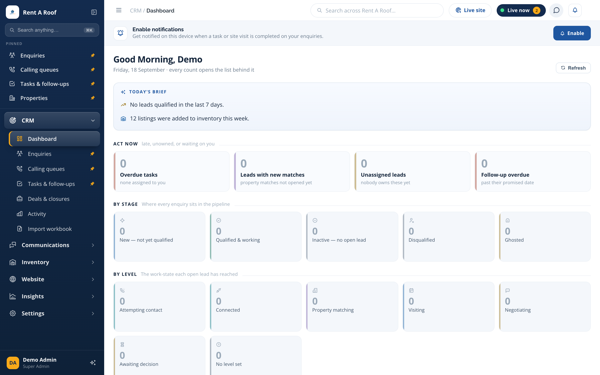
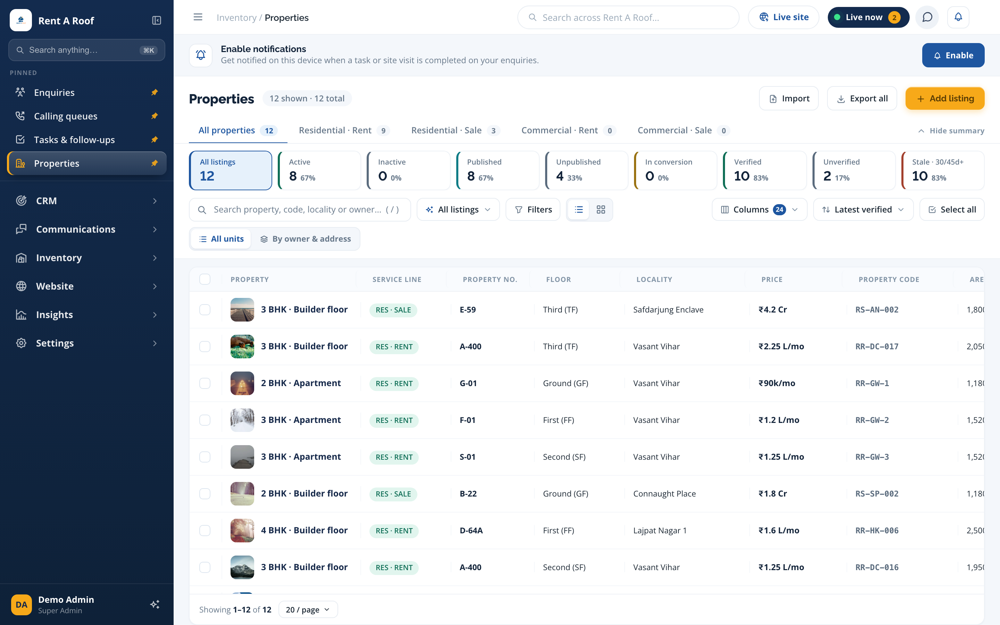
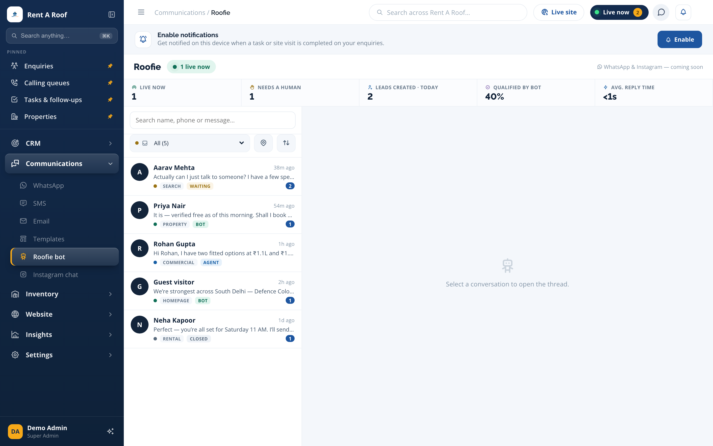

# Rent A Roof — Real-Estate CRM & Operations Platform

A production platform that runs a live real-estate brokerage end to end — **CRM, property inventory, automatic property↔lead matching, a website CMS, an AI front-desk assistant, and full communications** — in one system.

> 🔒 **This is a public showcase.** The full source lives in a private repository — I'm happy to grant access to serious reviewers on request. All screenshots below use **demo data** (real customer data, credentials, and phone numbers removed).

---

## What it does

### 🎯 CRM & lead lifecycle
A complete lead pipeline: enquiries move through stages (New → Qualified → Visiting → Negotiating → Won/Lost), each with tasks, follow-ups, calling queues, and role-based ownership across the team. Every count on the dashboard opens the exact list behind it.

### 🏢 Inventory management
Full property inventory — residential & commercial, rent & sale, multi-unit buildings, owner profiles, verification status, and locality mastering. Composable status tiles (Active / Published / Verified / Stale) double as filters.

### 🔗 Smart property ↔ lead matching
An engine automatically matches live inventory to open requirements and raises **match alerts** when a new property fits a waiting lead — surfaced on the dashboard, the workspace, and via notifications.

### 💬 Communications — the "front desk"
A unified inbox powered by **Roofie**, an AI assistant that greets website visitors, qualifies them, and books visits — with a human able to jump in anytime. Channels include **WhatsApp, SMS, Email, and templates**, with live KPIs (qualified-by-bot %, avg reply time, leads created today).

### 🌐 Website & CMS
The public property website is part of the same platform: searchable listings from live inventory, locality guides, a compare tray, lead-capture, and a full CMS for pages, menus, blog, and testimonials.

### 📊 Analytics & engagement tracking
Visitor tracking, campaign funnels (visitors → signups → enquiries → qualified → won), source attribution, and per-property engagement — so every lead's journey is visible.

---

## 📸 Screenshots

### The CRM
**Dashboard** — cohort board where every number opens its list

**Inventory** — live property listings with photos, status facets, and matching

**Communications** — the Roofie AI assistant inbox across WhatsApp / SMS / Email

### The public website
**Home**

**Listings** — live inventory with the on-site assistant

**Property detail** — full detail page with similar listings and services

*(More screens — enquiries, activity reports, team & access, website analytics — are in [`/screenshots`](screenshots).)*

---

## 🧰 Tech
`Laravel` · `Livewire` · `Alpine.js` · `Tailwind CSS` · `MySQL` · `PHP 8` · `Spatie Media Library` · REST APIs

## 🔑 Want to see the code?
The complete source is in a **private repository**. I grant reviewer access on request — just reach out.

---
Built by **[@abBytes-sudo](https://github.com/abBytes-sudo)** · abhimasih0505@gmail.com · +91 73039 37702
